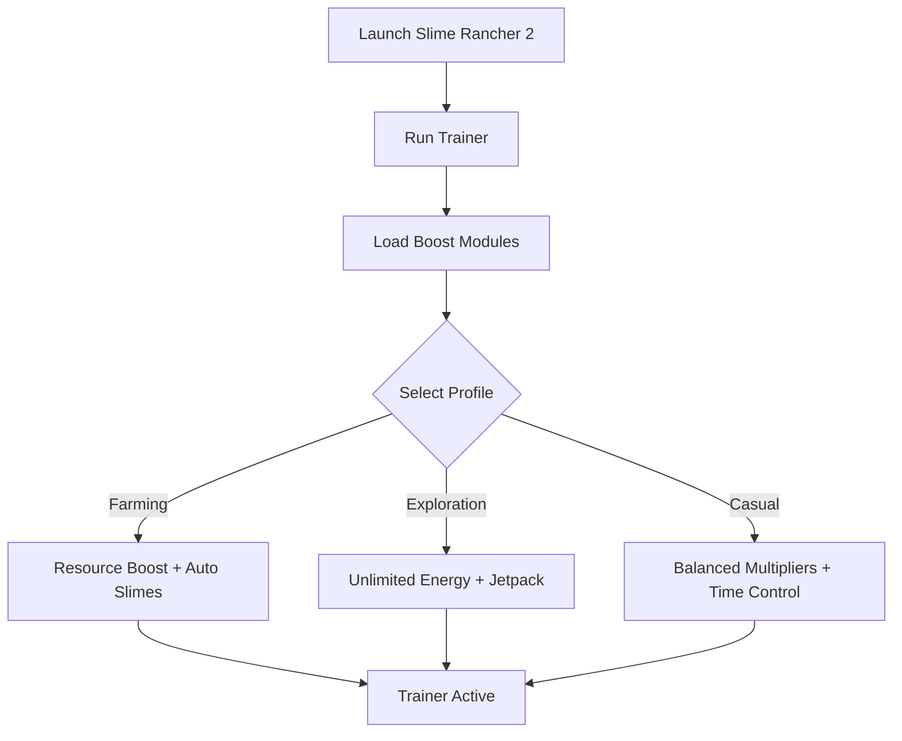

# Slime Rancher 2 Trainer 🟢

**Slime Rancher 2** continues the charming slime-collecting adventure with new biomes, resources, and creatures to discover. But the grind for plorts, upgrades, and expansions can slow progress. The **Slime Rancher 2 Trainer** gives you direct control with **resource multipliers, farming assists, and exploration aids**, helping you enjoy the game your way.

---

## 🌐 Overview

This trainer is built for **single-player efficiency and customization**. Whether you want to speed up resource collection, automate farming cycles, or unlock hidden exploration tools, the Trainer adapts with modular profiles. Lightweight and optimized for Windows 10/11, it keeps performance smooth while offering powerful boosts.

---

## 🔑 Features

* 💰 **Resource Boosts** – Infinite money, plorts, and food.
* 🟣 **Slime Assist** – Manage slime hunger and happiness automatically.
* 🌱 **Farm Automation** – Speed up garden and corral production.
* 🗺 **Exploration Tools** – Unlimited energy and jetpack stamina.
* ⚡ **Time Control** – Pause or accelerate day/night cycles.
* 🗂 **Profile Loader** – Save configs for farming, exploration, or casual play.
* ⌨️ **Hotkey Switching** – Toggle boosts instantly mid-game.
* 🔒 **Stealth Injection** – Lightweight trainer for Windows 10/11 PCs.

---

[](#)
[](#)
[](#)
[](#)

---

## 🖥 Compatibility

| Platform       | Status        | Notes                  |
| -------------- | ------------- | ---------------------- |
| Windows 10     | ✅ Supported   | Stable builds          |
| Windows 11     | ✅ Optimized   | Best performance       |
| Linux (Proton) | ⚠️ Partial    | Some functions limited |
| macOS          | ❌ Unsupported | VM workaround required |

\[!NOTE]
The trainer is designed for **Windows PC builds of Slime Rancher 2**.

---

## ⚙️ Setup Guide

1. Download the Slime Rancher 2 Trainer.

2. Extract files into a secure folder.

3. Launch the game.

4. Run the trainer as administrator:

   ```bash
   slime2_trainer.exe -game slimerancher2.exe -mode overlay
   ```

5. Configure your `trainer.ini`:

   ```ini
   [Resources]
   Money=Unlimited
   Plorts=Multiplier:3
   Food=Unlimited

   [Slimes]
   AutoFeed=True
   Happiness=Max

   [Exploration]
   Energy=Unlimited
   Jetpack=True
   ```

6. Toggle features with `F1–F6` hotkeys in-game.

\[!IMPORTANT]
Trainer is for **single-player use only**—avoid online sync conflicts.

---

## 📊 Workflow Diagram



---

## 🎚 Example Configurations

**Farming Profile:**

```ini
Money=Unlimited
Plorts=Multiplier:5
AutoFeed=True
```

**Exploration Profile:**

```ini
Energy=Unlimited
Jetpack=True
TimeControl=Paused
```

**Casual Play Profile:**

```ini
Money=Multiplier:2
Plorts=Multiplier:2
Food=Unlimited
```

\[!WARNING]
Extreme multipliers can trivialize gameplay—use moderate boosts for balance.

---

## ❓ FAQ

**Q: Does the trainer work in multiplayer?**
A: No, it’s strictly for single-player.

**Q: Will it affect FPS?**
A: No, it’s lightweight (<3% system load).

**Q: Can I swap configs mid-game?**
A: Yes, profiles are hotkey-swappable.

**Q: Do updates track game patches?**
A: Yes, trainer releases are synced with Slime Rancher 2 updates.

**Q: Can I reset values back to normal?**
A: Yes, disable the trainer or press `Reset` in the overlay.

---

## 🚀 Final Thoughts

The **Slime Rancher 2 Trainer** brings **resource boosts, slime management, and exploration assists** into one package. Whether you’re farming plorts, building out your ranch, or exploring new biomes, it lets you enjoy the game at your own pace.

[](#)
[](#)
[](#)

---
